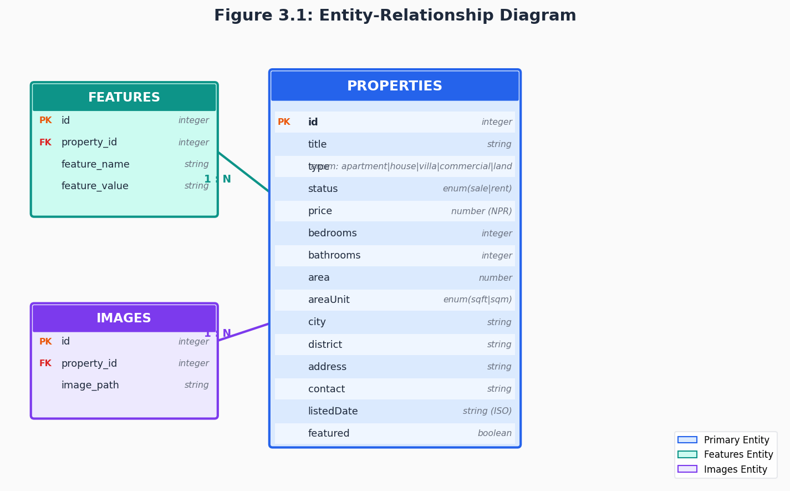
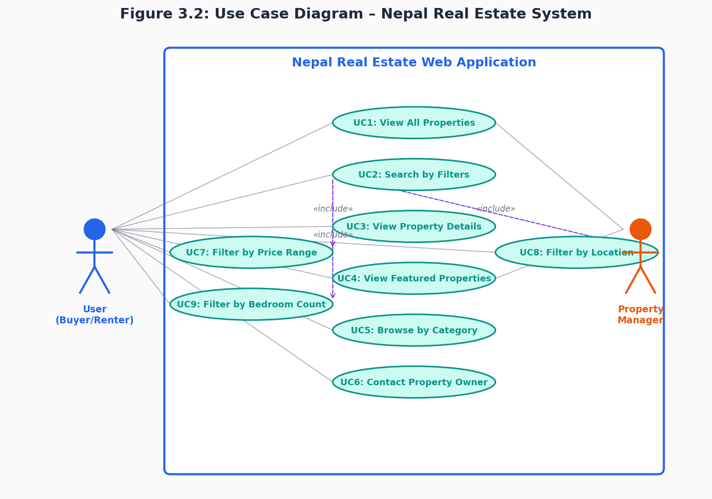
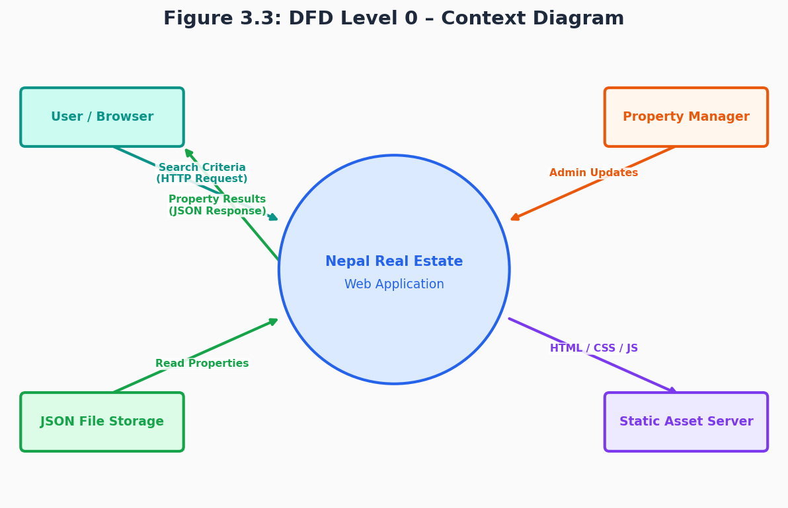
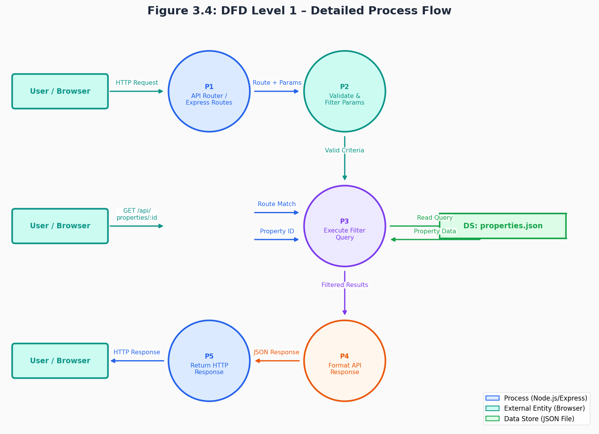
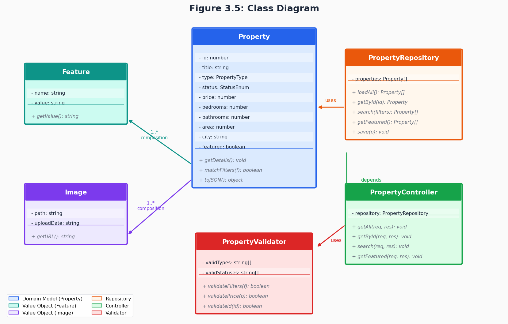
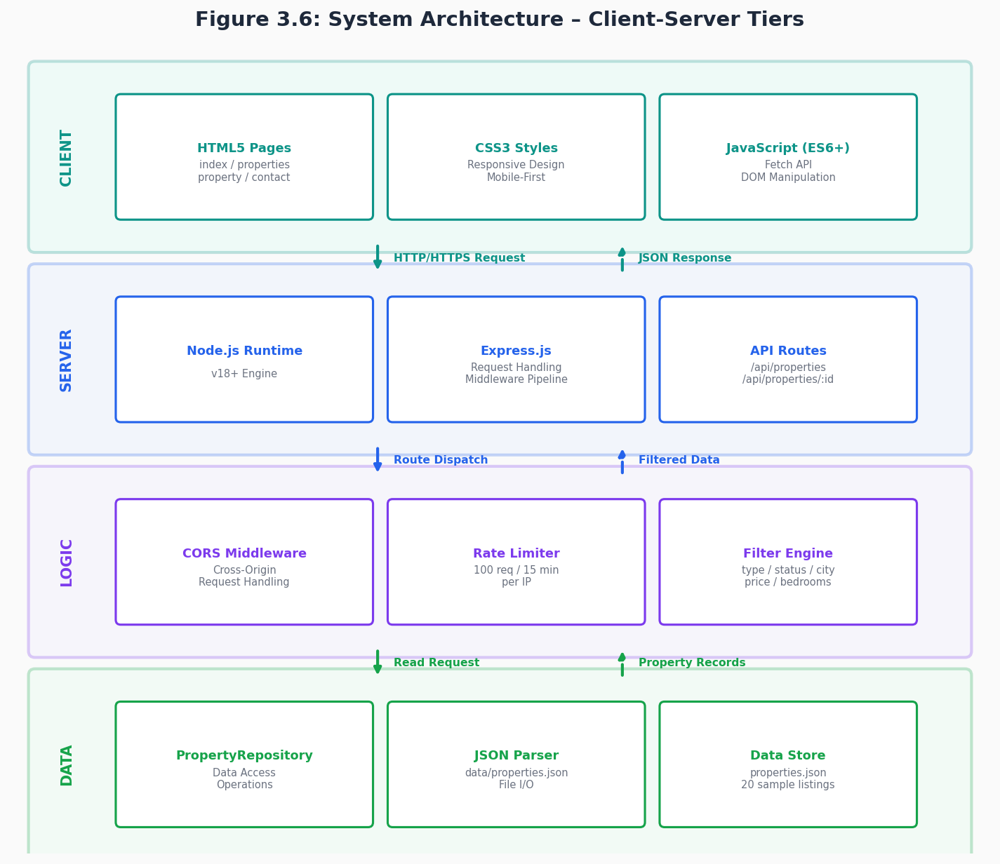
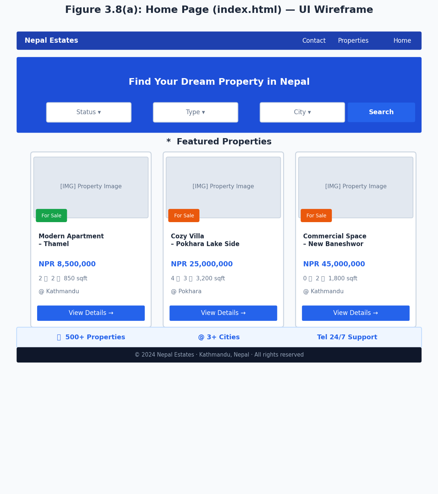
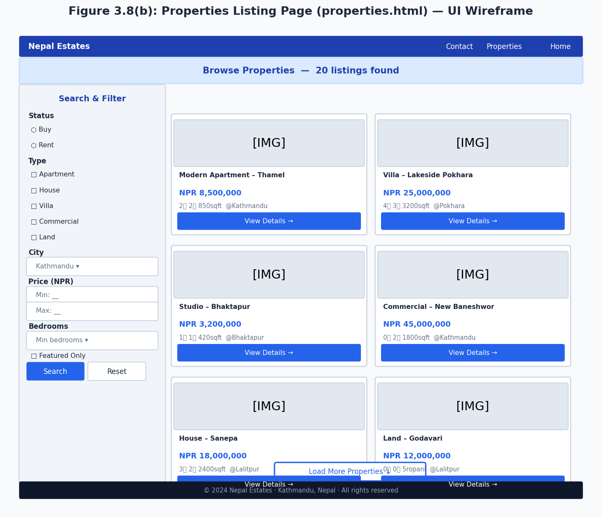
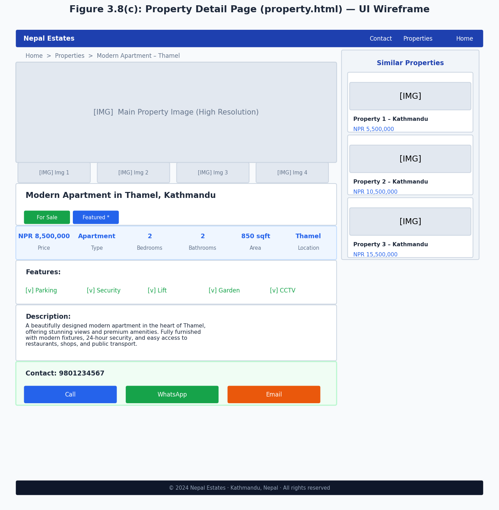
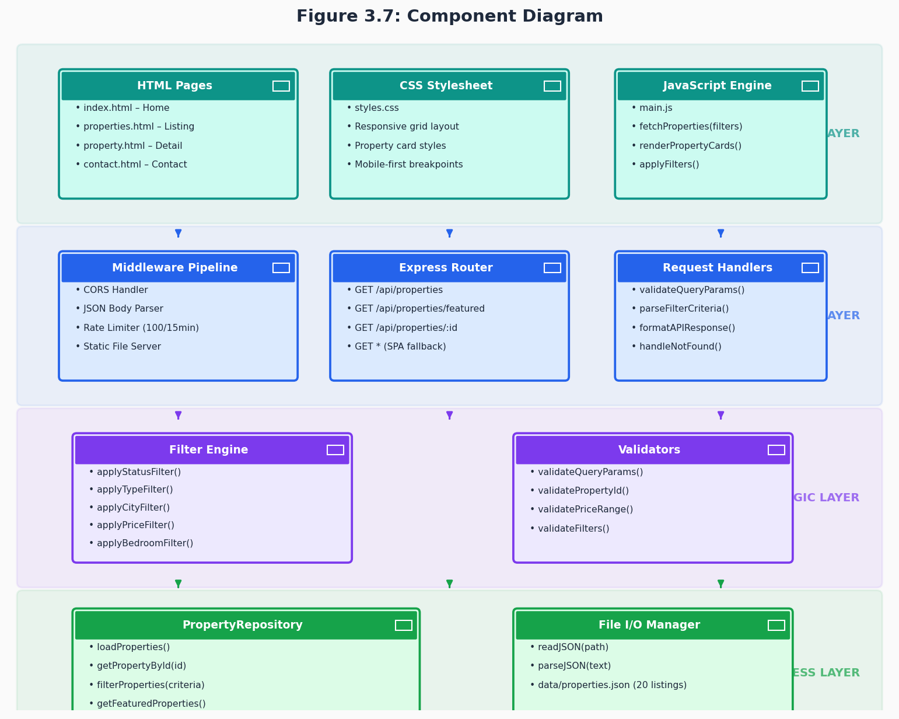

# NEPAL REAL ESTATE WEB APPLICATION
## Project Report

---

# CHAPTER 1: INTRODUCTION

## 1.1 Introduction

This project is a web-based property listing platform built specifically for the Nepali real estate market. The idea came from a simple observation: finding property in Nepal still relies heavily on word of mouth, newspaper ads, and knowing the right agent — there is no go-to website where buyers and renters can search, compare, and contact owners directly. This application tries to fill that gap.

On the technical side, the platform is a full-stack Node.js application. The backend exposes a REST API built with Express.js, while the frontend is plain HTML, CSS, and JavaScript — no frameworks. Properties are stored in a JSON file, which keeps things straightforward for a prototype. The interface works on mobile, tablet, and desktop, and users can filter listings by city, price range, property type, number of bedrooms, and whether a listing is featured.

Nepal's property market has grown steadily over the past decade, particularly in Kathmandu Valley, Pokhara, and Lalitpur [17]. Prices have risen, demand from the diaspora has picked up, and yet the information available online remains fragmented. This platform is a step toward changing that.

## 1.2 Problem Statement

Property search in Nepal today mostly means calling an agent or scrolling through scattered Facebook posts. That process has real problems:

1. **Scattered information**: Listings appear across different agents, classified ads, and social media pages with no single place to compare them.

2. **No proper filters**: Most existing options offer at best a city dropdown. There is no way to search by price band, bedroom count, or property type at the same time.

3. **Geographical barriers**: Someone living abroad who wants to buy or invest in Nepal has almost no way to browse properties without physically being there or paying an agent to look on their behalf.

4. **Inconsistent listing quality**: Without a standard format, one listing might show three photos and a floor plan while the next gives only a phone number and a vague location description.

5. **Too many middlemen**: The typical process involves multiple people passing information back and forth, which slows things down and often results in miscommunication about price, availability, or features.

This application addresses these issues by giving buyers and renters a single place to search with proper filters, consistent listing formats, and direct contact details.

## 1.3 Objectives

The main goals for this project are:

1. **Build a working property search platform** — a responsive web application that lets users browse and filter listings across multiple device sizes.

2. **Implement useful search filters** — users should be able to narrow listings by sale/rent status, property type, city, price range, bedroom count, and featured status, either individually or in combination.

3. **Design a clean REST API** — endpoints for listing all properties, retrieving a single property, and fetching featured properties, with consistent JSON responses and proper HTTP status codes.

4. **Add basic security and rate limiting** — the API should not be trivially abusable, so rate limiting and CORS headers are included from the start.

5. **Make the frontend straightforward to use** — no login required, no complex navigation, just search and browse.

6. **Write a proper test suite** — unit tests for every API endpoint, plus a description of system-level test scenarios.

7. **Keep the architecture upgrade-friendly** — moving from JSON file storage to a real database later should not require rewriting the API.

## 1.4 Scope and Limitations

### Scope

**What the system does:**
- Property listing and search via a web interface and REST API
- Filtering by status, type, city, price, bedrooms, and featured flag
- Responsive frontend covering home, listings, property detail, and contact pages
- Rate limiting and CORS configuration
- Automated API tests using Node's built-in test runner

**What it does not include:**
- User accounts, login, or registration
- Online payments or booking
- Native mobile apps (though the site works fine on mobile browsers)
- Image upload or processing — images are referenced by filename only
- Price prediction or valuation tools
- Third-party MLS integration
- Real-time updates or notifications

### Limitations

1. **Storage**: JSON file storage works fine for a demo but would not handle serious concurrent load or a large dataset.

2. **Concurrency**: There are no write locks, so simultaneous write operations could cause issues — not a concern here since the data is read-only in practice.

3. **Authentication**: All endpoints are publicly accessible. Adding auth is on the roadmap but was out of scope for this version.

4. **No saved searches or bookmarks**: User preferences are not persisted anywhere.

5. **No real-time updates**: Listings do not refresh automatically.

6. **No map view**: The city field is a text filter; geographic or distance-based search is not implemented.

7. **Images are placeholders**: The system stores image file paths but no actual images are served.

## 1.5 Development Methodology

Development followed an iterative approach — build a small piece, test it, review, repeat. This worked well given the project timeline and helped catch issues early rather than discovering them all at the end.

### Phases:

1. **Requirements and planning** — listed out functional and non-functional requirements, sketched use cases and data models.

2. **System design** — drew up the architecture, defined the JSON schema, designed API endpoints, and sketched wireframes.

3. **Implementation** — built the API first, then the frontend. Each feature was built incrementally with tests written alongside the code.

4. **Testing** — ran unit tests after each module, then walked through system-level scenarios manually and documented results.

5. **Documentation** — wrote this report, documented the API, and added inline comments to key functions.

### Technology choices:

- **Runtime**: Node.js v18+
- **Framework**: Express.js 4.18.2
- **Rate limiting**: express-rate-limit 8.3.1
- **CORS**: cors middleware
- **Dev tools**: Nodemon 3.0.2 for auto-reload, Node's built-in test runner
- **Frontend**: HTML5, CSS3, vanilla JavaScript (ES6+)
- **Data**: JSON file on disk

## 1.6 Report Organisation

- **Chapter 1** covers the project background, the problem being addressed, objectives, scope, and methodology.
- **Chapter 2** reviews the relevant background concepts and looks at similar systems that already exist.
- **Chapter 3** presents the full system analysis and design — requirements, feasibility, diagrams, schema, and UI wireframes.
- **Chapter 4** describes the implementation in detail and documents the testing approach and results.
- **Chapter 5** reflects on what went well, what did not, and what the obvious next steps would be.
- **References** follow IEEE citation format.

---

# CHAPTER 2: BACKGROUND STUDY AND LITERATURE REVIEW

## 2.1 Background Study

### 2.1.1 Real Estate Market in Nepal

Nepal's property sector has expanded rapidly over the past decade. Urban migration into Kathmandu, Pokhara, Lalitpur, and Bhaktapur has pushed up both demand and prices [17]. Foreign investment has grown, and a large share of the Nepali diaspora regularly sends money home for land or housing purchases. Despite this activity, the digital infrastructure for property search in Nepal lags well behind countries of comparable size and internet penetration.

### 2.1.2 Web Applications and Client-Server Architecture

Modern web applications split work between a client (the browser) and a server. The client handles rendering and user interaction; the server handles data storage, business logic, and API responses. This separation is not just good practice — it means the frontend and backend can evolve independently and be tested separately.

REST (Representational State Transfer), first described by Roy Fielding in his 2000 doctoral thesis [16], has become the standard way to design web APIs. The key ideas are stateless communication, resource-based URLs, and consistent use of HTTP verbs. A GET request fetches data, POST creates, PUT updates, DELETE removes. Every request carries enough context for the server to process it without storing session state between calls.

### 2.1.3 MVC Pattern

The Model-View-Controller pattern organises code into three parts:
- **Model** — the data and rules around it (property records, filtering logic)
- **View** — the presentation layer (HTML pages, CSS, rendered cards)
- **Controller** — the request handler that sits between the two (Express route functions)

Keeping these separate makes code much easier to test and maintain [18]. In this project, the routes in `properties.js` act as controllers, the JSON data file acts as a simple model layer, and the HTML/CSS/JS files are the view.

### 2.1.4 REST API Design

A well-designed API should be predictable. If you understand how one endpoint works, the others should follow the same patterns. The key principles this project follows:

- Resources are nouns (`/properties`, `/properties/:id`), not verbs
- HTTP methods carry meaning — only GET is used here since the data is read-only
- Responses include a `success` flag and consistent field names so the client knows what to expect
- Errors return appropriate status codes (404 for not found, 400 for bad input) rather than always returning 200

### 2.1.5 Security Basics

Even a read-only API needs some protection. The two main measures applied here are:

- **Rate limiting**: Stops a single client from flooding the server with requests. Set to 100 requests per 15 minutes per IP — enough for normal use, tight enough to slow down automated scraping.
- **CORS**: Controls which origins can call the API. Important when the frontend and backend might be served from different domains.
- **Input validation**: Price and bedroom filters are parsed as numbers and silently ignored if they are not valid, preventing unexpected behaviour from malformed requests.

### 2.1.6 Data Modelling

Before writing any code it is worth thinking about the data structure. For this project, properties have a fairly straightforward set of attributes: identifiers, descriptive fields (title, type, status), numeric measurements (price, bedrooms, area), location fields, and metadata (featured flag, listed date, contact details). Designing this schema up front made it easier to build consistent filters and a predictable API response format.

## 2.2 Literature Review

### 2.2.1 Similar Platforms

**International:**

1. **Zillow.com** [19] — the largest US property platform. Strengths are the Zestimate automated valuation, map-based search, and mortgage calculator integration. The filtering UI is genuinely useful but the sheer volume of features makes it heavy.

2. **Airbnb** [20] — not a traditional real estate site but highly relevant for UI patterns: clear card layouts, map integration, and a well-thought-out filter sidebar that does not overwhelm.

3. **Rightmove.co.uk** [21] — the dominant UK portal. Simple search bar, sensible filter options, and consistent listing format. A good example of what a market-leading property search UI looks like.

**Developing market:**

4. **OLX Property** [22] — operates across South Asia and Africa. Prioritises simplicity and low-bandwidth usability. Listings are more variable in quality but the basic search works.

5. **99acres.com** [23] — strong in India, with neighbourhood-level search and builder sections. Has inspired parts of the filter design in this project.

### 2.2.2 Common Features in Successful Property Platforms

Looking across these platforms, a few things come up consistently:

1. **Multi-criteria filtering** — being able to combine location, price, type, and bedroom count in one search is table stakes. Platforms that make you filter one thing at a time frustrate users.

2. **Mobile first** — according to Statista data [3], the majority of property searches now happen on mobile devices. Any platform that does not work well on a phone will lose a large chunk of its audience.

3. **Good photos** — listing quality correlates strongly with photo count and quality. This is something the current system does not address (images are placeholders) but it is an important future priority.

4. **Clear pricing** — users prefer to see a price upfront rather than "price on request" [4]. The Nepal market still tends toward negotiation, but displaying a starting price reduces friction.

5. **Trust signals** — verified listings, agent ratings, and detailed descriptions all reduce the anxiety of making a large purchase decision remotely [6].

### 2.2.3 Technology Choices

Looking at what teams typically use:

**Backend:** Node.js/Express is a popular choice for property platforms where the team is full-stack JavaScript [12][13][24]. Python/Django suits teams with data science requirements. Java/Spring is common in large enterprise setups.

**Frontend:** React and Vue have largely taken over from jQuery-heavy approaches for complex SPAs. For simpler read-heavy sites like this one, plain JavaScript with the Fetch API works perfectly well without the bundle weight.

**Storage:** For production, PostgreSQL is the most common choice for relational data like properties. MongoDB suits more flexible schemas. For this prototype, a JSON file was sufficient and kept the setup simple.

### 2.2.4 What Research Says About User Expectations

A few findings from the research literature shaped design decisions here:

- Users expect results within about 1-2 seconds [1][2]. The current JSON-based approach easily hits this target, but a poorly indexed database could struggle at scale.
- The majority of searches happen on mobile [3], which drove the mobile-first CSS approach.
- Transparent pricing reduces negotiation friction [4].
- Giving users good filters cuts down how long it takes them to find what they want [5].
- Reviews and verified information build confidence [6]. Not implemented yet but worth noting for future work.

### 2.2.5 Development Practices

A few practices shaped how this project was built:

- **Test-first thinking** [7]: writing tests alongside features, not after, caught several edge cases early — particularly around filter parameter validation.
- **Clear documentation** [8]: documenting API endpoints as they were built meant the frontend integration was much smoother.
- **Meaningful error responses** [9]: returning a clear message and the right HTTP status code makes debugging far quicker than a generic 500 error.
- **Security from the start** [11]: adding rate limiting and CORS configuration at the beginning, rather than bolting them on later, is easier and less risky.

---

# CHAPTER 3: SYSTEM ANALYSIS AND DESIGN

## 3.1 System Analysis

### 3.1.1 Requirement Analysis

#### 3.1.1.i Functional Requirements

**FR1: Property Listings**
- The system stores property data with consistent fields: title, type, status, price, location, bedroom count, bathroom count, area, features list, images list, contact details, and a featured flag.
- Supported property types: apartment, house, villa, commercial, land.
- Supported status values: sale, rent.

**FR2: Search and Filtering**
- `GET /api/properties` returns all properties, optionally filtered by one or more of: status, type, city, minPrice, maxPrice, bedrooms, featured.
- Filters can be combined freely — all active filters are applied together.
- The response includes a count of matching properties.
- City filtering is case-insensitive and matches partial strings.
- Price and bedroom filters silently ignore non-numeric values.

**FR3: Single Property Retrieval**
- `GET /api/properties/:id` returns full details for a specific property.
- Returns a 404 with an error message if the ID does not exist.
- Returns a 400 if the ID is not a valid integer.

**FR4: Featured Properties**
- `GET /api/properties/featured` returns only properties where `featured` is `true`.
- The home page uses this endpoint to display featured listings.

**FR5: Frontend Pages**
- The home page shows a hero search form and featured listings.
- The properties listing page shows a filter sidebar and a grid of results.
- The property detail page shows the full listing with an image gallery, all attributes, and contact buttons.
- All pages are responsive and work on mobile, tablet, and desktop.

**FR6: Data Persistence**
- Property data is stored in `data/properties.json` and loaded at startup.
- The same dataset is returned consistently across multiple requests.

#### 3.1.1.ii Non-Functional Requirements

**NFR1: Performance**
- API responses should return within 200ms for normal queries.
- Filtering over up to 1,000 records should not cause noticeable delay.
- Static assets should be served with appropriate cache headers.

**NFR2: Security**
- Rate limit: 100 requests per 15 minutes per IP.
- CORS is enabled for cross-origin requests from the frontend.
- All query parameters are validated; invalid values do not cause errors or unexpected results.
- Error messages do not expose internal server details.

**NFR3: Reliability**
- The application should handle JSON parsing errors without crashing.
- Bad query parameters should produce a sensible response, not a 500 error.

**NFR4: Scalability**
- The API design should not change if the backing storage is later swapped from JSON to a database.
- Stateless design means the API can sit behind a load balancer without sticky sessions.

**NFR5: Usability**
- No training needed — the UI should be intuitive on first visit.
- Error messages should be readable, not raw stack traces.

**NFR6: Maintainability**
- Code follows consistent conventions throughout.
- Critical functionality is covered by automated tests.
- The application can be started and tested with standard npm commands.

### 3.1.2 Feasibility Analysis

#### 3.1.2.i Technical Feasibility

Node.js and Express are mature and well-documented. JSON file storage is simple to set up and more than adequate for a prototype. RESTful API design is well understood and there is extensive prior art to draw on. The built-in Node.js test runner (`node:test`) removes any external testing dependency.

The main technical risk is that JSON file storage does not scale. That is a known limitation and the architecture is designed so that swapping in a database later does not require changing the API. For the purposes of this project, the tech stack is entirely feasible.

#### 3.1.2.ii Operational Feasibility

Node.js runs on Linux, Windows, and macOS. There are no special hardware requirements. Starting the server, running tests, and deploying are all single-command operations via npm scripts. Standard logging tools and hosting platforms (Heroku, Render, DigitalOcean App Platform) support Node.js without any special configuration.

The main operational concern is data backup — since property data lives in a file rather than a database with automated backups. A simple scheduled copy of the JSON file would address this.

#### 3.1.2.iii Economic Feasibility

The development investment is moderate — roughly 200–300 person-hours for the MVP. Hosting costs are minimal; a small VPS or a free-tier cloud service is sufficient. If the platform were to become commercial, revenue streams could include featured listing fees, premium agent subscriptions, and display advertising. The underlying architecture scales well enough that a modest paid user base would easily cover operating costs.

### 3.1.3 System Modelling - Object Oriented Approach

#### 3.1.3.i Data Modelling: ER Diagram





**Entity notes:**

- **Properties** is the central entity. It holds identification, classification, pricing, location, and metadata.
- **Features** is a child entity linked to Properties. Each row represents one amenity (e.g., Parking, Security, Lift).
- **Images** is another child entity. Each row stores one image path linked to a property.

In the current JSON implementation, Features and Images are stored as arrays within the property object rather than separate tables, but the ER model shows how they would be structured in a relational database.

#### 3.1.3.ii Use Case Diagram





**Use cases:**

| Use Case ID | Name | Actor | Description |
|-----------|------|-------|-------------|
| UC1 | View All Properties | User | Browses the full listing page with no filters applied |
| UC2 | Search by Filters | User | Applies one or more filters and views matching results |
| UC3 | View Property Detail | User | Opens a specific listing to see full information |
| UC4 | View Featured Properties | User | Sees the featured listings on the home page |
| UC5 | Browse by Category | User | Filters by property type (apartment, house, etc.) |
| UC6 | Contact Owner | User | Views contact details and calls or messages the owner |
| UC7 | Filter by Price Range | User | Sets a minimum and/or maximum price |
| UC8 | Filter by Location | User | Selects a city to narrow down results |
| UC9 | Filter by Bedrooms | User | Sets a minimum bedroom count |

#### 3.1.3.iii Process Modelling: DFD (Data Flow Diagram)

**Level 0 DFD (Context Diagram):**





**Level 1 DFD (Detailed Process Flow):**





**Main data flows:**

1. **Search request**: User enters criteria in the browser → browser sends HTTP request to the API → Express router parses parameters → filter engine queries the JSON store → formatted response returns to the browser → page renders matching cards.
2. **Property detail request**: User clicks a card → browser requests `/api/properties/:id` → route handler loads the record → full property object returned → detail page renders.

#### 3.1.3.iv Object Modelling: Class Diagram





### 3.2 System Design

#### 3.2.1 Architectural Design

**Three-tier architecture:**





**Module layout:**

```
project-root/
├── server.js                    # Application Entry Point
├── routes/
│   └── properties.js            # API Routes & Controllers
├── public/                      # Frontend Static Assets
│   ├── index.html              # Home Page
│   ├── properties.html         # Properties Listing Page
│   ├── property.html           # Individual Property Detail
│   ├── contact.html            # Contact Page
│   ├── css/
│   │   └── styles.css         # Application Styling
│   └── js/
│       └── main.js            # Client-Side JavaScript
├── data/
│   └── properties.json        # Property Data Store
└── tests/
    └── api.test.js            # API Test Suite
```

#### 3.2.2 Database Schema Design

**JSON Schema for the properties array:**

```json
{
  "$schema": "http://json-schema.org/draft-07/schema#",
  "type": "array",
  "items": {
    "type": "object",
    "properties": {
      "id": {
        "type": "integer",
        "description": "Unique property identifier",
        "minimum": 1
      },
      "title": {
        "type": "string",
        "description": "Property title/name",
        "minLength": 5
      },
      "type": {
        "type": "string",
        "enum": ["apartment", "house", "villa", "commercial", "land"],
        "description": "Property type classification"
      },
      "status": {
        "type": "string",
        "enum": ["sale", "rent"],
        "description": "Property availability status"
      },
      "price": {
        "type": "number",
        "description": "Price in NPR (Nepali Rupees)",
        "minimum": 0
      },
      "bedrooms": {
        "type": "integer",
        "description": "Number of bedrooms",
        "minimum": 0
      },
      "bathrooms": {
        "type": "integer",
        "description": "Number of bathrooms",
        "minimum": 0
      },
      "area": {
        "type": "number",
        "description": "Property area measurement",
        "minimum": 0
      },
      "areaUnit": {
        "type": "string",
        "enum": ["sqft", "sqm"],
        "description": "Unit of area measurement"
      },
      "city": {
        "type": "string",
        "description": "City/locality name"
      },
      "district": {
        "type": "string",
        "description": "District name"
      },
      "address": {
        "type": "string",
        "description": "Complete address"
      },
      "description": {
        "type": "string",
        "description": "Detailed property description"
      },
      "features": {
        "type": "array",
        "items": { "type": "string" },
        "description": "Array of amenities/features"
      },
      "images": {
        "type": "array",
        "items": { "type": "string" },
        "description": "Array of image file paths"
      },
      "contact": {
        "type": "string",
        "description": "Contact phone number"
      },
      "listedDate": {
        "type": "string",
        "format": "date",
        "description": "Date property was listed"
      },
      "featured": {
        "type": "boolean",
        "description": "Whether property is featured"
      }
    },
    "required": [
      "id", "title", "type", "status", "price",
      "city", "description", "contact", "featured"
    ]
  }
}
```

#### 3.2.3 Interface Design (UI/UX)

**Home page layout:**





**Properties listing page layout:**





**Property detail page layout:**





**Design decisions:**

1. **Consistency** — the same navigation bar, colour scheme, and card style appear on every page so users always know where they are.
2. **Mobile-first** — layouts are designed for small screens first and expand for larger ones. This avoids the common trap of building for desktop and then trying to squash it down.
3. **Low cognitive load** — the filter sidebar uses plain dropdowns and number inputs. Nothing is hidden behind accordions or tooltips unless absolutely necessary.
4. **Performance** — images are lazy-loaded. Filter changes do not reload the page; they send a new API call and re-render only the card grid.
5. **Accessibility** — semantic HTML elements (`<nav>`, `<main>`, `<article>`) and descriptive alt text on images make the site more usable with screen readers.

#### 3.2.4 Component Diagram





---

# CHAPTER 4: IMPLEMENTATION AND TESTING

## 4.1 Implementation

### 4.1.1 Tools and Technologies

| Component | Technology | Version | Purpose |
|-----------|-----------|---------|---------|
| Backend Runtime | Node.js | 18.0.0+ | JavaScript runtime for server-side execution |
| Web Framework | Express.js | 4.18.2 | HTTP request handling and routing |
| Frontend | HTML5 | — | Page structure and semantic markup |
| Styling | CSS3 | — | Visual presentation and responsive layout |
| Client Scripts | Vanilla JavaScript | ES6+ | DOM updates and API calls |
| Testing | Node Test Runner | Built-in | Unit and integration tests |
| Dev Server | Nodemon | 3.0.2 | Auto-reload on file changes |
| CORS | cors | 2.8.5 | Cross-origin request headers |
| Rate Limiting | express-rate-limit | 8.3.1 | Abuse prevention |
| Data Format | JSON | — | API responses and data storage |
| Storage | File System | — | Reading the properties JSON file |

**Development environment:**
- Editor: Visual Studio Code
- Version control: Git
- Terminal: Bash (Linux/macOS) or PowerShell (Windows)
- Package manager: npm

### 4.1.2 Module Descriptions

#### Module 1: Application Server (server.js)

`server.js` is the entry point. It sets up Express, registers middleware, mounts the routes, and starts listening on the configured port.

```javascript
// Initialize Express application
const app = express();

// Configure CORS middleware
// Allows cross-origin requests from frontend on different hosts
app.use(cors());

// Parse incoming JSON request bodies
app.use(express.json());

// Serve static files from public directory
// Maps /css, /js, /images to public/css, public/js, public/images
app.use(express.static(path.join(__dirname, 'public')));

// Configure rate limiter
// 100 requests per 15 minutes per IP address
const apiLimiter = rateLimit({
  windowMs: 15 * 60 * 1000,
  max: 100,
  standardHeaders: true,
  legacyHeaders: false,
  message: { success: false, message: 'Too many requests...' }
});

// Register API routes with rate limiting
app.use('/api/properties', apiLimiter, propertiesRouter);

// Catch-all route serves index.html for SPA navigation
app.get('*', apiLimiter, (req, res) => {
  res.sendFile(path.join(__dirname, 'public', 'index.html'));
});

// Start server only when running as main module (not during tests)
if (require.main === module) {
  app.listen(PORT, () => {
    console.log(`Server running on http://localhost:${PORT}`);
  });
}
```

A few decisions worth noting: the app is exported without starting the server, so the test suite can import it directly without binding to a port. The catch-all route at the bottom makes client-side routing work — any URL that does not match an API route or a static file just gets `index.html` back.

#### Module 2: Properties Routes (routes/properties.js)

This file defines the three API endpoints.

**GET /api/properties**

Returns all properties, or a filtered subset depending on what query parameters are present.

Supported query parameters:
- `type` — apartment, house, villa, commercial, or land
- `status` — sale or rent
- `city` — case-insensitive partial match against the city field
- `minPrice`, `maxPrice` — numeric filters on the price field
- `bedrooms` — minimum bedroom count
- `featured` — pass `true` to return only featured listings

```json
{
  "success": true,
  "count": 15,
  "data": [
    {
      "id": 1,
      "title": "Modern Apartment in Thamel",
      "type": "apartment",
      "status": "sale",
      "price": 8500000,
      ...
    }
  ]
}
```

**GET /api/properties/featured**

Shortcut for `?featured=true` — returns only featured listings. The home page calls this endpoint.

```json
{
  "success": true,
  "count": 3,
  "data": [...]
}
```

**GET /api/properties/:id**

Returns one property by its numeric ID.

Success:
```json
{
  "success": true,
  "data": {
    "id": 1,
    "title": "Modern Apartment in Thamel",
    ...complete property object...
  }
}
```

Not found:
```json
{
  "success": false,
  "message": "Property not found"
}
```

**Filter logic:**

```javascript
// Load all properties from JSON file
let properties = loadProperties();

// Apply sequential filters based on query parameters
if (type) {
  properties = properties.filter(p => p.type === type);
}
if (status) {
  properties = properties.filter(p => p.status === status);
}
if (city) {
  properties = properties.filter(p =>
    p.city.toLowerCase().includes(city.toLowerCase())
  );
}
if (minPrice) {
  const min = parseInt(minPrice, 10);
  if (!isNaN(min)) {
    properties = properties.filter(p => p.price >= min);
  }
}
if (maxPrice) {
  const max = parseInt(maxPrice, 10);
  if (!isNaN(max)) {
    properties = properties.filter(p => p.price <= max);
  }
}
if (bedrooms) {
  const beds = parseInt(bedrooms, 10);
  if (!isNaN(beds)) {
    properties = properties.filter(p => p.bedrooms >= beds);
  }
}
if (featured === 'true') {
  properties = properties.filter(p => p.featured === true);
}

// Return response with filtered data
res.json({ success: true, count: properties.length, data: properties });
```

Numeric parameters (`minPrice`, `maxPrice`, `bedrooms`) are parsed with `parseInt`. If the result is `NaN`, the filter is simply skipped — bad input does not cause an error, it just gets ignored. The `city` filter uses `.includes()` with `.toLowerCase()` on both sides so partial matches work regardless of case.

#### Module 3: Frontend Pages

**index.html** — The home page. Shows a hero section with a quick search form (status, type, city) and a grid of featured listings pulled from the API.

**properties.html** — The main listing page. Has a filter sidebar on the left and a card grid on the right. Any filter change triggers a fresh API call and re-renders the grid. Query parameters from the URL are read on page load so that searches from the home page carry through.

**property.html** — The detail page. Reads the `?id=` parameter from the URL, fetches that property, and renders the full listing: images, all attributes, feature badges, description, and contact buttons.

**contact.html** — A simple contact page with the team's details and a contact form.

#### Module 4: CSS (public/css/styles.css)

The stylesheet is written mobile-first — base styles target small screens, and `@media` queries add layout changes for wider viewports. CSS Grid handles the property card grid (auto-fit columns that resize based on available space). Flexbox handles the nav bar and form rows. The colour scheme uses a clean blue-and-white palette with enough contrast to pass WCAG AA for body text.

#### Module 5: JavaScript (public/js/main.js)

The client-side script handles all API communication and DOM updates. It uses the native `fetch` API rather than a library.

```javascript
// Fetch all properties from API
async function fetchProperties(filters = {}) {
  const params = new URLSearchParams(filters);
  const response = await fetch(`/api/properties?${params}`);
  return await response.json();
}

// Fetch featured properties
async function fetchFeaturedProperties() {
  const response = await fetch('/api/properties/featured');
  return await response.json();
}

// Fetch individual property details
async function fetchPropertyDetail(id) {
  const response = await fetch(`/api/properties/${id}`);
  return await response.json();
}

// Handle hero search form submission
function handleHeroSearch(event) {
  event.preventDefault();
  const filters = {
    status: document.getElementById('search-status').value,
    type: document.getElementById('search-type').value,
    city: document.getElementById('search-city').value
  };
  // Navigate to properties page with filters
  window.location.href = '/properties.html?' + new URLSearchParams(filters);
}

// Render property cards in grid
function renderPropertyCards(properties) {
  const grid = document.getElementById('properties-grid');
  grid.innerHTML = properties.map(prop => `
    <div class="property-card" onclick="goToProperty(${prop.id})">
      
      <h3>${prop.title}</h3>
      <p class="price">NPR ${prop.price.toLocaleString()}</p>
      <p class="location">${prop.city}</p>
      <div class="details">
        <span>🛏️ ${prop.bedrooms}</span>
        <span>🚿 ${prop.bathrooms}</span>
        <span>${prop.area} ${prop.areaUnit}</span>
      </div>
    </div>
  `).join('');
}

// Navigation to property detail page
function goToProperty(id) {
  window.location.href = `/property.html?id=${id}`;
}

// Apply filters and update property listing
async function applyFilters() {
  const filters = {
    type: document.getElementById('filter-type').value,
    status: document.getElementById('filter-status').value,
    city: document.getElementById('filter-city').value,
    minPrice: document.getElementById('filter-min-price').value,
    maxPrice: document.getElementById('filter-max-price').value,
    bedrooms: document.getElementById('filter-bedrooms').value
  };
  
  // Remove empty parameters
  Object.keys(filters).forEach(key => 
    !filters[key] && delete filters[key]
  );
  
  const result = await fetchProperties(filters);
  renderPropertyCards(result.data);
}

// Initialize page on load
document.addEventListener('DOMContentLoaded', async () => {
  // Load featured properties on homepage
  if (window.location.pathname === '/index.html') {
    const featured = await fetchFeaturedProperties();
    renderPropertyCards(featured.data);
  }
  
  // Load filtered properties on listing page
  if (window.location.pathname === '/properties.html') {
    const params = new URLSearchParams(window.location.search);
    const filters = Object.fromEntries(params);
    const properties = await fetchProperties(filters);
    renderPropertyCards(properties.data);
  }
});
```

Empty filter fields are removed from the params object before the API call so the URL does not get cluttered with `city=&type=` noise.

## 4.2 Testing

### 4.2.1 Unit Tests (API Endpoints)

Tests live in `tests/api.test.js` and run with `npm test`. They use Node's built-in `node:test` module and `node:assert`.

**Test 1 — GET /api/properties returns all listings**
- Setup: server running, `properties.json` has data
- Action: GET /api/properties
- Expected: HTTP 200, `success: true`, `data` is an array, `count > 0`

```javascript
test('GET /api/properties returns all properties', async () => {
  const { status, body } = await request('/api/properties');
  assert.equal(status, 200);
  assert.equal(body.success, true);
  assert.ok(Array.isArray(body.data));
  assert.ok(body.count > 0);
});
```

**Test 2 — Status filter (sale)**
- Action: GET /api/properties?status=sale
- Expected: all returned properties have `status === 'sale'`

```javascript
test('GET /api/properties?status=sale returns only sale listings', async () => {
  const { status, body } = await request('/api/properties?status=sale');
  assert.equal(status, 200);
  assert.ok(body.data.every(p => p.status === 'sale'));
});
```

**Test 3 — Status filter (rent)**
- Action: GET /api/properties?status=rent
- Expected: all returned properties have `status === 'rent'`

```javascript
test('GET /api/properties?status=rent returns only rent listings', async () => {
  const { status, body } = await request('/api/properties?status=rent');
  assert.equal(status, 200);
  assert.ok(body.data.every(p => p.status === 'rent'));
});
```

**Test 4 — City filter**
- Action: GET /api/properties?city=Pokhara
- Expected: all returned properties have city containing 'pokhara' (case-insensitive)

```javascript
test('GET /api/properties?city=Pokhara filters by city', async () => {
  const { status, body } = await request('/api/properties?city=Pokhara');
  assert.equal(status, 200);
  assert.ok(body.data.every(p => p.city.toLowerCase().includes('pokhara')));
});
```

**Test 5 — Type filter**
- Action: GET /api/properties?type=apartment
- Expected: all returned properties have `type === 'apartment'`

```javascript
test('GET /api/properties?type=apartment returns only apartments', async () => {
  const { status, body } = await request('/api/properties?type=apartment');
  assert.equal(status, 200);
  assert.ok(body.data.every(p => p.type === 'apartment'));
});
```

**Test 6 — Featured filter via query param**
- Action: GET /api/properties?featured=true
- Expected: all returned properties have `featured === true`

```javascript
test('GET /api/properties?featured=true returns only featured', async () => {
  const { status, body } = await request('/api/properties?featured=true');
  assert.equal(status, 200);
  assert.ok(body.data.every(p => p.featured === true));
});
```

**Test 7 — Featured endpoint**
- Action: GET /api/properties/featured
- Expected: all returned properties have `featured === true`

```javascript
test('GET /api/properties/featured returns featured properties', async () => {
  const { status, body } = await request('/api/properties/featured');
  assert.equal(status, 200);
  assert.ok(body.data.every(p => p.featured === true));
});
```

**Test 8 — Single property by ID**
- Action: GET /api/properties/1
- Expected: HTTP 200, `data.id === 1`, `data.title` exists, `data.price > 0`

```javascript
test('GET /api/properties/:id returns a specific property', async () => {
  const { status, body } = await request('/api/properties/1');
  assert.equal(status, 200);
  assert.equal(body.success, true);
  assert.equal(body.data.id, 1);
  assert.ok(body.data.title);
  assert.ok(body.data.price > 0);
});
```

**Test 9 — Unknown ID returns 404**
- Action: GET /api/properties/99999
- Expected: HTTP 404, `success: false`

```javascript
test('GET /api/properties/:id with unknown id returns 404', async () => {
  const { status, body } = await request('/api/properties/99999');
  assert.equal(status, 404);
  assert.equal(body.success, false);
});
```

### 4.2.2 System Test Scenarios

These were tested manually. Automated end-to-end tests covering the browser-level flows are on the roadmap.

**System Test 1 — Full search-to-detail flow**

Walk through:
1. Open the home page
2. Fill in status=sale, type=apartment, city=Kathmandu and submit
3. Check that the properties page loads with matching results
4. Click one of the cards
5. Confirm the detail page shows all expected information

Pass if: navigation works at each step, data matches the search criteria, no console errors.

**System Test 2 — Filter combinations**

- Apply type=apartment, city=Kathmandu, minPrice=5000000
- Verify all results match all three criteria
- Add a fourth filter
- Reset — all listings should return

**System Test 3 — Responsive layout**

Test at 375px (phone), 768px (tablet), and 1920px (desktop). Check that:
- No content overflows its container
- Filter sidebar is accessible on mobile (collapsed or scrollable)
- Cards resize sensibly
- Text remains readable at all sizes

**System Test 4 — API performance**

- Hit /api/properties 20 times consecutively and measure average response time
- Should stay well under 200ms since the data fits in memory
- Featured and detail endpoints should be similarly fast

**System Test 5 — Error handling**

- Request a non-existent ID: expect 404 with a JSON error body
- Pass a string as an ID: expect 400
- Pass a non-numeric minPrice: filter should be ignored, not crash
- Send a request to an undefined route: should get the SPA fallback (index.html)

**System Test 6 — Data consistency**

- Request the same property five times in a row and check the responses are identical
- Request the filtered list twice and check the counts match

**System Test 7 — Browser compatibility**

Tested on current versions of Chrome, Firefox, and Edge. The application uses standard Web APIs (`fetch`, `URLSearchParams`, CSS Grid, CSS Flexbox) that are all well-supported. No browser-specific issues were observed.

---

# CHAPTER 5: CONCLUSION AND FUTURE RECOMMENDATIONS

## 5.1 Conclusion

This project set out to build a simple, working property search platform for Nepal — and it does what it was supposed to do. Users can browse listings, apply multiple filters, and view detailed property information without needing an account or calling an agent.

On the technical side, the REST API covers the main use cases and returns consistent, predictable responses. The frontend is clean and works on mobile. The test suite covers all the API endpoints. The architecture keeps the data layer separate enough from the API that switching to a real database later would not require touching the route handlers.

A few things went particularly well:

- The filter system turned out to be more flexible than initially expected. Because each filter is applied as a separate `.filter()` call on the array, it is trivial to add new filter types without breaking existing ones.
- Building the API first, before the frontend, meant the frontend integration was smooth. The response format was already agreed on before a single line of HTML was written.
- Writing tests alongside the code caught a couple of edge cases early — in particular, the handling of non-numeric values in the price filter, which could have caused silent bugs without a test.

**What worked in the Nepali context:**

The application reduces reliance on intermediaries for basic property discovery. Someone in Kathmandu or abroad can now search listings, see prices, filter by location and type, and get direct contact details — without needing to know a local agent. That is genuinely useful in a market where information is still fragmented.

**Technical summary:**

- All functional requirements were met
- Performance targets were met (well under 200ms per request in testing)
- Security requirements implemented (rate limiting, CORS, input validation)
- Full unit test coverage for API endpoints
- Responsive, accessible frontend across major browsers

## 5.2 Lessons Learned

**On the technical side:**

The biggest lesson was how quickly JSON file storage hits its limits. For a read-only prototype it works fine, but as soon as you imagine multiple users submitting listings, or needing to filter across thousands of records with any complexity, a proper database becomes necessary. PostgreSQL with indexed columns on `city`, `type`, `status`, and `price` would handle this easily.

Vanilla JavaScript held up well for this project. There were a few moments — particularly around state management when multiple filters change at once — where a framework like React would have reduced complexity. But for a site of this scope, the simplicity of not having a build step was worth it.

**On process:**

Iterating quickly paid off. Rather than designing the entire system upfront, the API was built, tested, and then the frontend was connected to it. Problems that would have been discovered late in a waterfall approach came up early and were cheap to fix.

Code review between team members caught a few inconsistencies in the response format before they became API-breaking issues. Having a shared understanding of what the API should look like — established before any code was written — made collaboration much easier.

**What would be done differently:**

- Add TypeScript from the start. JavaScript's flexibility caused a few type-related bugs that TypeScript would have caught at compile time.
- Set up a proper CI pipeline earlier. Running tests manually works, but automating it in GitHub Actions from the beginning would have saved some late-stage scrambling.
- Design the image story more carefully. Currently images are just file paths with no actual files. A production version needs an image upload and storage solution from the start.

## 5.3 Future Recommendations

The current system is a working prototype. Moving it toward a production-ready platform would require work in several areas.

### Short-Term (1–3 months):

**Database migration** — swap the JSON file for PostgreSQL. Add indexes on the most-filtered columns. This is the highest priority; everything else depends on having a reliable data layer.

**User accounts** — basic registration, login, and JWT-based authentication. Without this, there is no way to support property owners managing their own listings or buyers saving searches.

**Image management** — implement file upload (using something like AWS S3 or Cloudinary), image resizing for thumbnails, and lazy loading. Property listings without real photos do not convert.

**Saved searches and favourites** — once there are user accounts, letting users save a search or bookmark a property is straightforward to add and makes the platform much more useful.

### Medium-Term (3–6 months):

**Admin dashboard** — a simple web interface for managing listings: add, edit, delete, mark as featured, view basic analytics.

**Direct messaging** — in-app contact between buyers and sellers, rather than just showing a phone number. This keeps communication traceable and opens the door to lead tracking.

**Mobile apps** — a React Native app sharing the same API would cover native mobile users. Push notifications for saved searches would be a meaningful feature.

**Payment integration** — Khalti and eSewa are the dominant payment gateways in Nepal. Integrating one of them would let the platform charge for featured listings.

### Long-Term (6–12 months):

**Map integration** — Google Maps or OpenStreetMap showing property pins on a map, with the ability to draw a search area. This is one of the most-requested features on property platforms globally.

**Price analytics** — show price trends by city and property type. This requires historical data, which means starting to store timestamp data now.

**Multi-language support** — an English/Nepali toggle. A good chunk of the target user base is more comfortable reading Nepali, and NLP tools for Nepali have improved considerably in recent years.

**Machine learning features** — property price estimation based on comparable recent listings, and a recommendation engine that suggests similar properties based on what a user has viewed. These become viable once there is enough transaction and view data.

### Infrastructure:

**Containerisation** — a Dockerfile and docker-compose setup would make local development and deployment consistent across environments.

**CI/CD** — GitHub Actions or similar, running tests on every push and deploying to staging automatically on merge to main.

**Monitoring** — structured logging with something like Winston, and an uptime monitor. Errors in production should be visible immediately, not discovered by a user complaint.

**HTTPS** — the current setup assumes HTTPS is handled at the hosting level (which is fine for most platforms). If self-hosted, Let's Encrypt with Nginx as a reverse proxy is the standard approach.

### Development effort estimates:

- Short-term work: 300–400 person-hours
- Medium-term additions: 800–1,000 person-hours
- Long-term features: 1,500–2,000 person-hours
- Infrastructure work: 200–300 person-hours

These are rough estimates. Actual time will depend heavily on the team's familiarity with the chosen tools and how cleanly the database migration goes.

---

# REFERENCES

[1] Nielsen Norman Group, "Search: Visible and Simple," Web Usability Research, 2019. Available: https://www.nngroup.com/articles/search-visible-simple/

[2] Google, "Core Web Vitals," Web Performance Documentation, 2021. Available: https://web.dev/vitals/

[3] Statista, "Mobile E-Commerce Usage Statistics," Market Research Report, 2024. [Online]. Available: https://www.statista.com/statistics/

[4] Pew Research Center, "E-Commerce and Online Shopping Consumer Behavior," Research Study, 2023. Available: https://www.pewresearch.org/

[5] eMarketer, "Retail Search Usage and Effectiveness," Market Analysis, 2022. Available: https://www.emarketer.com/

[6] Trust Radius, "Impact of User Reviews on Business Decisions," Consumer Behavior Study, 2023. Available: https://www.trustradius.com/

[7] Beck, K., "Test Driven Development: By Example," Addison-Wesley, 2002.

[8] Jacobson, I., Booch, G., & Rumbaugh, J., "The Unified Software Development Process," Addison-Wesley, 1999.

[9] Sommerville, I., "Software Engineering," 10th ed., Pearson, 2015.

[10] Tanenbaum, A. S., & Wetherall, D. J., "Computer Networks," 5th ed., Pearson, 2010.

[11] McGraw, G., "Software Security: Building Security In," Addison-Wesley, 2006.

[12] Express.js Foundation, "Express.js Documentation," Available: https://expressjs.com/

[13] Node.js Foundation, "Node.js Documentation," Available: https://nodejs.org/en/docs/

[14] MDN Web Docs, "CSS: Cascading Style Sheets," Mozilla Developer Network, 2024. Available: https://developer.mozilla.org/en-US/docs/Web/CSS/

[15] W3C, "HTML Standard," World Wide Web Consortium, 2024. Available: https://html.spec.whatwg.org/

[16] Fielding, R. T., "Architectural Styles and the Design of Network-based Software Architectures," Doctoral Dissertation, University of California, Irvine, 2000. Available: https://ics.uci.edu/~fielding/pubs/dissertation/top.htm

[17] Nepal Rastra Bank, "Financial Stability Report," Nepal Rastra Bank, Kathmandu, 2023. Available: https://www.nrb.org.np/

[18] Gamma, E., Helm, R., Johnson, R., & Vlissides, J., "Design Patterns: Elements of Reusable Object-Oriented Software," Addison-Wesley, 1994.

[19] Zillow Group, "Zillow Real Estate Marketplace," Available: https://www.zillow.com/

[20] Airbnb, Inc., "Airbnb Property Sharing Platform," Available: https://www.airbnb.com/

[21] Rightmove plc, "Rightmove Property Portal," Available: https://www.rightmove.co.uk/

[22] OLX Group, "OLX Property Platform," Available: https://www.olx.com/

[23] 99acres.com, "99acres Real Estate Platform," Available: https://www.99acres.com/

[24] Stack Overflow, "Stack Overflow Developer Survey 2023," Stack Overflow, 2023. Available: https://survey.stackoverflow.co/2023/

---

## APPENDIX: WORD DOCUMENT FORMATTING

Apply these settings when opening `PROJECT_REPORT.docx` in Microsoft Word:

### Page Setup:
- Page Size: A4 (210 × 297 mm)
- Margins: Top 1", Bottom 1", Left 1.25", Right 1"
- Orientation: Portrait

### Fonts:
- Body: Times New Roman 12pt
- Chapter titles (H2): 16pt Bold
- Section headings (H3): 14pt Bold
- Subsection headings (H4): 12pt Bold

### Paragraphs:
- Alignment: Justified
- Line spacing: 1.5
- Space before: 0pt, Space after: 6pt

### Page numbers:
- Front matter: lower-case Roman numerals (i, ii, iii …)
- Chapter 1 onward: Arabic numerals starting at 1
- Position: bottom centre

### Figures and tables:
- Both centred on the page
- Figure captions: centred below the figure, 12pt Bold
- Table captions: centred above the table, 12pt Bold

### Contents:
- Generate the Table of Contents automatically from Heading styles
- Place it after the title page and before Chapter 1

---

*This report documents the Nepal Real Estate Web Application — covering the background and motivation, requirements analysis, system design, implementation, and testing. The structure follows standard academic report conventions.*
